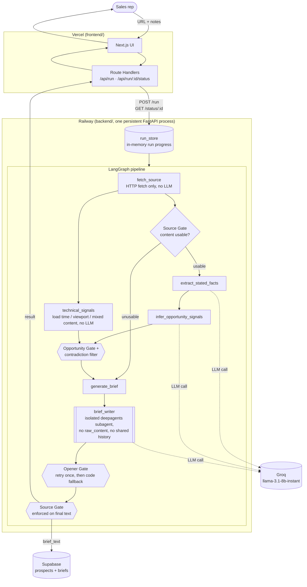

# ColdCallPrep

ColdCallPrep is a deep agent harness that fetches a prospect's website,
quotes what they say about themselves, and flags gaps worth mentioning,
so a sales rep can walk into a cold call with a research brief they can
actually trust instead of a wall of AI-generated guesswork.

A rep pastes a company URL (+ optional notes). ColdCallPrep fetches
the site, quotes what the company literally says about itself, and
separately flags opportunity signals inferred from what's missing,
never blending the two. Every claim in the output is either a direct
quote or a labeled inference with its reasoning shown alongside it.

The core discipline is enforced in code, not just prompted for:

- **Opportunity Gate** (`backend/agent/gates.py::opportunity_gate`), an
  inferred signal only enters the brief if it has both a signal type and
  a non-empty reasoning string.
- **Source Gate** (`source_is_usable` / `enforce_source_gate`), if the
  site fetch fails or returns near-empty content, the brief says so
  explicitly instead of inventing facts to fill the gap.
- **Opener Gate** (`opener_gate_violations`), the outreach opener is
  checked for fabricated referrals, invented prior meetings, or a
  greeting to a name not present in the notes/facts; a violation
  triggers a retry, then a plain code-templated fallback that can't
  violate the gate.

`backend/tests/test_gates.py` proves all three with no LLM call
involved.

## Architecture



Diamonds are routing decisions the graph itself makes (`route_after_fetch`);
hexagons are the three code-enforced gates (`backend/agent/gates.py`) that
sit between whatever the model produced and what the user is allowed to
see. Dotted arrows are the only points in the whole pipeline that touch
an LLM. `fetch_source` and `technical_signals` never do.

The repo is a monorepo with two independent projects side by side:
`frontend/` (Next.js) and `backend/` (FastAPI), plus a top-level
`supabase/` directory holding the shared database schema used by the
backend.

A completed run is also written to Supabase (`prospects` + `briefs`
tables) by `backend/supabase_client.py`, one write per run, from the
backend right when the pipeline finishes.

## Prerequisites

- Node.js 18.17+ and npm
- Python 3.10+
- A [Groq](https://console.groq.com) API key (free tier; separate from
  any Claude/Anthropic account)
- A [Supabase](https://supabase.com) project (free tier)

## Setup

### 1. Clone and install the frontend

```bash
cd frontend
npm install
cp .env.example .env.local
```

`.env.local` only needs one value for local dev, the default
(`BACKEND_URL=http://localhost:8000`) already matches the backend setup
below, so you likely don't need to edit it.

### 2. Set up the backend

From the project root (open a fresh terminal, or `cd ..` back out of `frontend/` first):

```bash
cd backend
python3 -m venv .venv
source .venv/bin/activate
pip install -r requirements.txt
cp .env.example .env
```

Edit `backend/.env` and fill in:
- `GROQ_API_KEY`, from [console.groq.com](https://console.groq.com)
- `SUPABASE_URL` / `SUPABASE_SERVICE_ROLE_KEY`, from your Supabase
  project's **Settings → API** (use the service_role / "Secret key",
  not the anon/publishable one)

### 3. Create the Supabase tables

In your Supabase project's **SQL Editor**, run the contents of
[`supabase/migrations/0001_init.sql`](supabase/migrations/0001_init.sql).

### 4. Run it

One command, from `frontend/`, once the venv from step 2 exists:

```bash
cd frontend
npm run dev:all
```

This starts both the backend (`uvicorn`, auto-loading `backend/.env`,
watching `backend/` for changes) and the frontend (`next dev`) together,
with labeled/colored output. Ctrl+C once stops both, no orphaned
processes.

Prefer two separate terminals (e.g. to see backend logs on their own)?

```bash
# Terminal 1, backend (from the project root)
cd backend && source .venv/bin/activate
uvicorn main:app --reload --port 8000
```

```bash
# Terminal 2, frontend (from the project root)
cd frontend
npm run dev
```

Open **http://localhost:3000**, click **Example** to fill in a demo
prospect with zero typing, then **Generate Brief**. The progress strip
reflects real backend steps as they happen, the "Writing brief" step
(an isolated LLM subagent call) is usually the slowest, taking up to
~30–60s.

## Deployment

Frontend and backend deploy independently, to Vercel and Railway
respectively.

**Vercel**: set **Root Directory** to `frontend` when importing this
repo; Vercel may auto-detect `backend/` as a second deployable service,
but don't accept that. The backend's in-memory run store and its
background pipeline execution both need one persistent process, not
serverless functions. That's what Railway is for. Add one environment
variable: `BACKEND_URL`, pointing at the Railway backend's URL.

**Railway**: deploys `backend/` via the included `Procfile`.
`backend/.env` is gitignored and never reaches Railway, so
`GROQ_API_KEY`, `SUPABASE_URL`, and `SUPABASE_SERVICE_ROLE_KEY` must be
set directly in Railway's dashboard (**Variables** tab). Without them
the service builds and starts fine, `/health` will even return
`200 OK`, but every real run fails at the first LLM call.

## Tests

```bash
cd backend
source .venv/bin/activate
pytest tests/ -v
```

65 tests, all pure unit tests, no API key or network access required.
This is where the three gates are proven correct in isolation.

## Isolated tool scripts

`backend/scripts/` has three scripts for exercising individual pieces
of the pipeline against a real Groq call, each demonstrating one of the
gates live rather than just unit-testing the gate function in isolation:

```bash
cd backend && source .venv/bin/activate
GROQ_API_KEY=... python scripts/test_infer_signals.py <url>     # Opportunity Gate
GROQ_API_KEY=... python scripts/test_generate_brief.py          # Opener Gate
GROQ_API_KEY=... python scripts/test_full_pipeline.py <url> "<notes>"  # all three, end to end
```

## What's not built

- No auth, this is a single-user take-home demo. The Supabase RLS
  policies allow all access via the service-role key.
- No UI for browsing past runs, completed runs are persisted to
  Supabase but the frontend doesn't read them back or show history.
